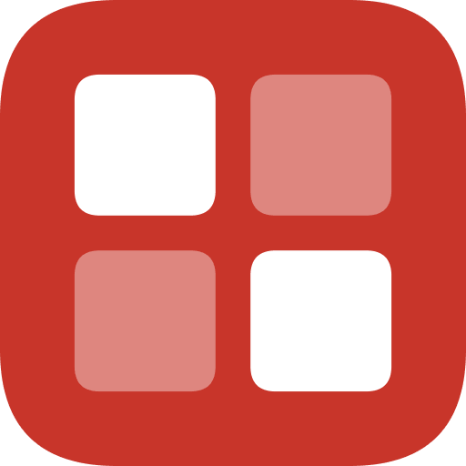
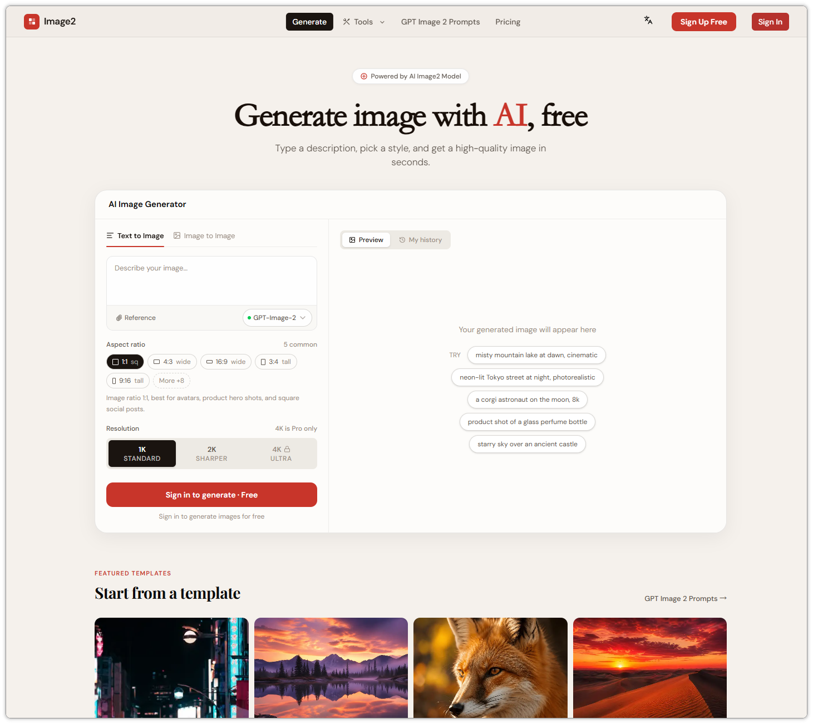
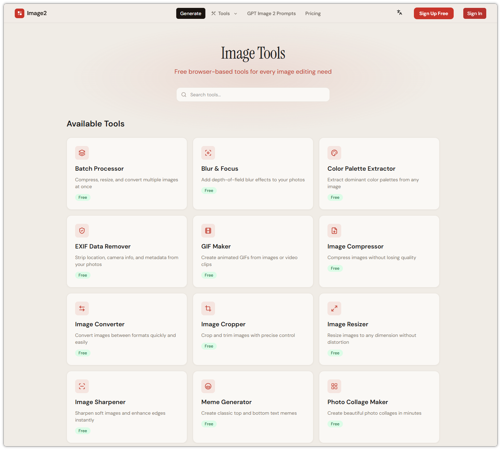
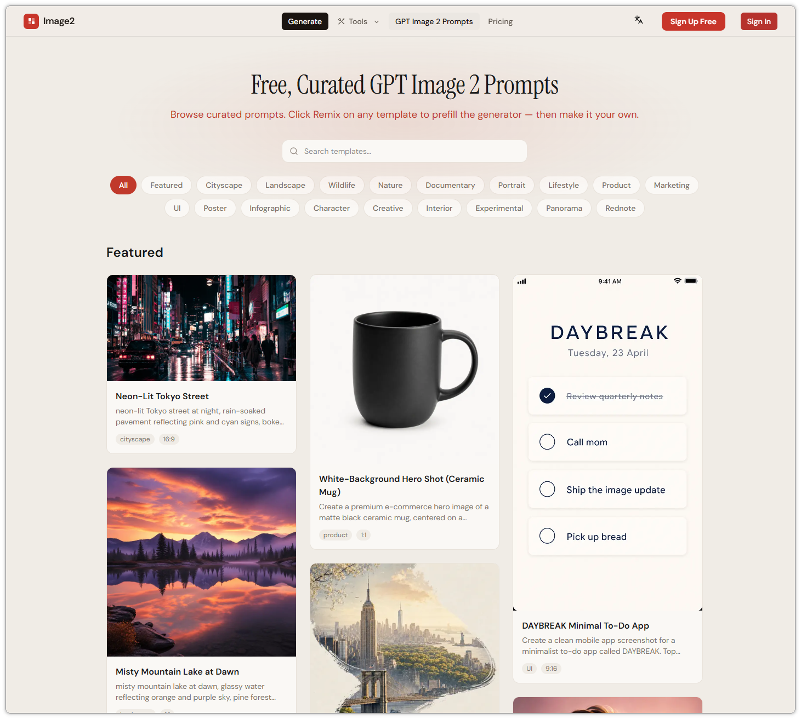

# Image2

**The Swiss Army knife of AI image tools — right in your browser.**

20+ free, no-watermark, privacy-first tools for AI image generation, editing, conversion, and inspiration — all in one place.

### [Open Image2 →](https://image-2.net)

[All Tools](https://image-2.net/tools/) · [Prompt Library](https://image-2.net/gpt-image-2-prompts/) · [Blog](https://image-2.net/blog/) · [Pricing](https://image-2.net/pricing/) · [简体中文](https://image-2.net/zh-cn/)

---

## What is Image2?

**Image2** is a free, browser-based platform that brings together everything you need to work with images — powered by AI where it matters, fast and lightweight where it doesn't.

Whether you want to **generate an image from a text prompt**, **remove a background in one click**, **compress a folder of photos**, or **grab a ready-to-use prompt** for your next project, Image2 has a dedicated tool for it.

- No installs
- No accounts required to try
- No watermarks
- No image uploads for most tools — your files stay on your device
- Works on desktop and mobile

---

## Highlights

| | |
| --- | --- |
| **Fast** | Built on edge infrastructure. Most tools return results in seconds. |
| **Private** | Many tools run entirely in the browser. Your images never leave your device. |
| **Free** | Every tool offers a free tier. No watermarks, commercial use allowed. |
| **Bilingual** | Full English and Simplified Chinese (简体中文) support. |
| **All-in-one** | 20+ tools under a single, consistent interface. |

---

## Tool Catalog

### AI Generation & Creative
- [AI Image Generator](https://image-2.net/tools/ai-image-generator/) — text-to-image in high resolution
- [Face Swap](https://image-2.net/tools/face-swap/) — intelligent face swapping
- [Style Transfer](https://image-2.net/tools/style-transfer/) — apply artistic styles to any photo
- [Portrait Studio](https://image-2.net/tools/portrait-studio/) — AI portraits and avatars

### Retouching & Cleanup
- [Background Remover](https://image-2.net/tools/background-remover/) — one-click cutouts
- [Watermark Remover](https://image-2.net/tools/watermark-remover/) — erase watermarks intelligently
- [Watermark Tool](https://image-2.net/tools/watermark-tool/) — add custom watermarks
- [Image Enhancer](https://image-2.net/tools/image-enhancer/) — upscale and enhance quality
- [Image Sharpener](https://image-2.net/tools/image-sharpener/) — sharpen blurry photos
- [Blur & Focus](https://image-2.net/tools/blur-focus/) — depth-of-field effects
- [EXIF Remover](https://image-2.net/tools/exif-remover/) — strip metadata for privacy

### Format Conversion & Editing
- [Image Compressor](https://image-2.net/tools/image-compressor/) — lossless & lossy compression
- [Image Converter](https://image-2.net/tools/image-converter/) — JPG / PNG / WebP / AVIF interconversion
- [Image Resizer](https://image-2.net/tools/image-resizer/) — resize by pixel or percentage
- [Image Cropper](https://image-2.net/tools/image-cropper/) — precise cropping with aspect ratios
- [Rotate & Flip](https://image-2.net/tools/rotate-flip/) — orientation fixes

### Social & Creative
- [Text on Image](https://image-2.net/tools/text-on-image/) — add captions and typography
- [Meme Generator](https://image-2.net/tools/meme-generator/) — classic meme maker
- [GIF Maker](https://image-2.net/tools/gif-maker/) — build animated GIFs
- [Photo Collage](https://image-2.net/tools/photo-collage/) — multi-photo layouts
- [Color Palette Extractor](https://image-2.net/tools/color-palette-extractor/) — pull dominant colors from any image

### Productivity
- [Batch Processor](https://image-2.net/tools/batch-processor/) — bulk compress, convert, rename, ZIP download

### Prompt Library
- [GPT Image 2 Prompts](https://image-2.net/gpt-image-2-prompts/) — a curated, searchable collection of ready-to-use AI image prompts (portraits, products, illustrations, anime, 3D, and more). Copy, tweak, and paste straight into the [AI Image Generator](https://image-2.net/tools/ai-image-generator/).

---

## Who is it for?

- **Designers** who need quick mockups, cutouts, and reference images
- **Content creators & marketers** producing thumbnails, banners, and social posts
- **E-commerce sellers** preparing product photos at scale
- **Bloggers & writers** looking for original cover images
- **Anyone** who wants a clean, fast image tool without installing software

---

## Screenshots

---

## Roadmap

- More AI generation models and styles
- Expanded prompt library with category filters and tagging
- Mobile app (PWA installable)
- API access for power users
- More languages

---

## Stay in Touch

- Website: **[image-2.net](https://image-2.net)**
- Blog & tutorials: [image-2.net/blog](https://image-2.net/blog/)
- Pricing & plans: [image-2.net/pricing](https://image-2.net/pricing/)
- Contact: support@image-2.net

If Image2 saves you time, please give this repo a star — it really helps.

---

**Image2 — AI image tools, all in one place.**

[Open the site →](https://image-2.net)

---

